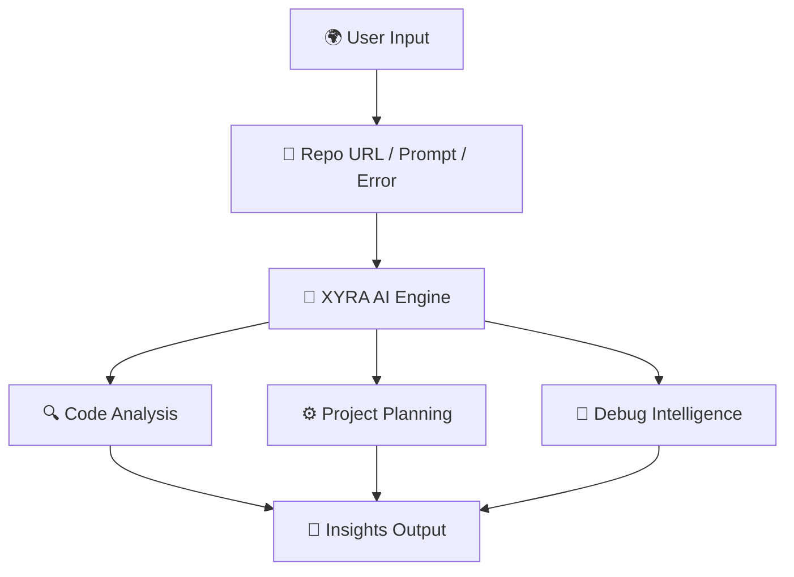

# 🚀 XYRA AI

<p align="center">
  
</p>

<p align="center">
  
</p>

<p align="center">
  <b>🌌 AI-Powered Developer Platform for Code Understanding, Debugging & Project Generation</b>
</p>

<p align="center">
  XYRA helps developers understand unfamiliar codebases, solve bugs, and turn ideas into real products instantly.
</p>

---

# 🧠 About XYRA AI

**XYRA AI** is a futuristic developer tool built to remove confusion and save time.

Instead of spending hours reading repositories, fixing bugs, or planning project structures manually, XYRA gives instant AI-powered clarity.

### ✨ What XYRA Can Do

- 📂 Understand any GitHub repository instantly  
- 🐛 Fix bugs with smart AI guidance  
- 🏗️ Build complete projects from prompts  
- ⚡ Learn architecture, stack & flow faster  
- 🚀 Ship ideas quicker  

---

# 🔥 Core Features

## 📂 Codebase Understanding *(Main Feature)*

<p align="center">
  
</p>

Paste any GitHub repository URL and XYRA AI analyzes it instantly.

- 📖 Human-readable project summary  
- 🗂️ Folder & file breakdown  
- ⚙️ Full tech stack detection  
- 🧩 Architecture insights  
- 📍 Start-here onboarding guide  

---

## 🐛 Bug Fix Assistant

<p align="center">
  
</p>

Paste any error or stack trace.

- 🔍 Clear explanation  
- ⚡ Suggested fixes  
- 📁 Likely file location  
- 💡 Better coding practices  

---

## 🏗️ Build Project From Idea

<p align="center">
  
</p>

Describe your startup, SaaS, or app idea.

- 📁 Folder structure  
- ⚙️ Tech stack suggestions  
- 🔌 API routes  
- 🗄️ Database schema  
- 🎨 Frontend pages/components  
- 🚀 Launch roadmap  

---

# ⚡ How It Works


# 🛠️ Tech Stack

<p align="center">


</p>

---

# 🌌 Vision

To become the **AI copilot for every developer** — helping people understand software, build faster, and turn imagination into code.

---

# 🚧 Current Progress

- ✅ Space Themed Landing Page  
- ✅ Hero Section UI  
- ✅ Showcase Section  
- ✅ Animated Logo Strip  
- 🚧 GitHub Repo Analyzer  
- 🚧 Prompt to Project Generator  
- 🚧 AI Bug Assistant  
- 🚧 Dashboard Experience  

---

# 🤝 Contributing

```bash
git clone https://github.com/xyraa04/Xyra_AI.git
cd Xyra_AI
npm install
npm run dev
 ```
⭐ Support

If you like this project, give it a star ⭐ on GitHub.
